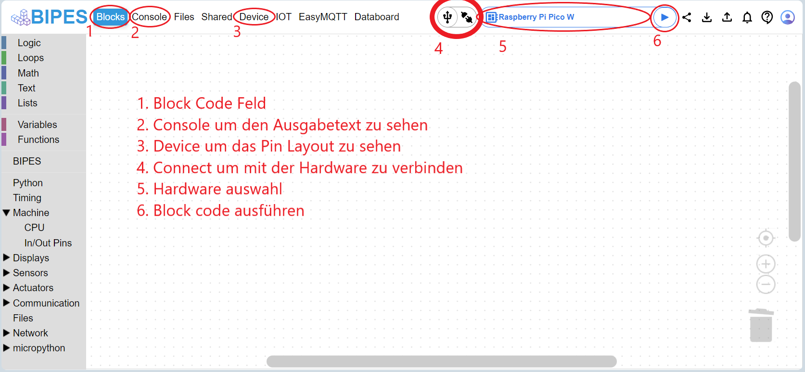

# BIPES IDE

1. Wähle als erstes den Raspberry PI Pico W als deine Hardware aus (5).
2. Um dich erstmals mit dem Pico zu verbinden nutze das Verbindesymbol (4).
3. Unter Blocks (1) steckst du die Blöcke zusammen um dann den Code mit dem Play-Knopf (6) auszuführen.
4. In der Console (2) kannst du Information vom Raspberry PI Pico auslesen und Fehlersuche betreiben.
5. Wenn du das Pin-Layout vom Raspberry PI Pico sehen willst kannst du dies unter Device (3).
