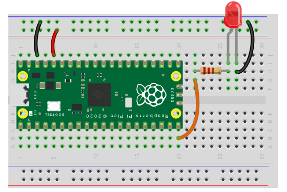

# LED Blinken

## Einführung

Eine LED, oder Leuchtdiode, ist ein kleines Bauelement, das Licht ausstrahlt, wenn Strom durch sie fließt. LEDs werden in vielen elektronischen Geräten verwendet, da sie energieeffizient und langlebig sind. In diesem Projekt werden wir mit BIPES eine einfache LED zum Blinken bringen, um sicherzustellen, dass unser Setup korrekt funktioniert.

## Material

- Raspberry PI pico
- LED (Leuchtdiode)
- Widerstand (220 Ohm oder ähnlich)
- Breadboard und Verbindungskabel
- Kabel

## Schritt-für-Schritt Anleitung

### 1. Fritzing

Verkabel den Raspberry PI Pico wie im Bild unten, achte dabei darauf dass das längere Bein der LED mit dem positiven Pol und das kürzere mit `GND` (Erde) verbunden ist. 

### 2. Block-Code Programmierung mit BIPES

Anstatt dir genau zu sagen, wie du die Blöcke zusammensetzen sollst, werden wir dir Bilder von den benötigten Blöcken zeigen. Es ist deine Aufgabe, herauszufinden, wie sie zusammenpassen!

Ziel ist es eine LED zum blinken zu bringen.
Verwende hierzu folgenden Blöcke:

1. Unter `Loops`, einmal:
    
    

2. Unter `Machine -> In/Out Pins`, zwei mal:
    
    

3. Unter `Timing`, zwei mal:

    

Experimentiere mit den Blöcken, um das gewünschte Blinkmuster zu erstellen und übertrage dann das Programm auf den Raspberry PI pico.

### 3. Teste deine LED

Sobald du das Programm übertragen hast, sollte die LED anfangen zu blinken.

## Problemlösung

Wenn die LED nicht blinkt:

- Überprüfe alle Verbindungen.
- Schau das die richtigen Pins vom Pico sowohl im BIPES gewählt wurden.
- Stelle sicher, dass der Widerstand und die LED korrekt platziert sind.
- Überprüfe, ob du die richtigen Blöcke in BIPES verwendet hast und ob sie in der richtigen Reihenfolge sind.

## Fazit

Gut gemacht! Durch das Experimentieren und Ausprobieren mit den BIPES-Blöcken hast du selbstständig eine funktionierende Testumgebung geschaffen. Dies ist der erste Schritt auf unserem Weg, unsere Pflanziska zum Leben zu erwecken.

## Vertiefende Materie

### Was ist eine LED und warum sind Dioden wichtig?

LED steht für "Light Emitting Diode" oder auf Deutsch "Licht emittierende Diode". Eine Diode ist ein elektronisches Bauelement, das Strom in nur eine Richtung passieren lässt. Das bedeutet, dass sie wie ein elektronischer Rückschlagventil funktioniert: Strom kann von einer Seite zur anderen fließen, aber nicht zurück. 

In der Elektrotechnik sind Dioden extrem wichtig und haben viele Anwendungen. Hier sind einige Gründe, warum und wofür Dioden verwendet werden:

1. **Gleichrichtung**: In Geräten, die Wechselstrom (z. B. aus der Steckdose) in Gleichstrom umwandeln müssen (z. B. Ladegeräte), werden Dioden verwendet, um den Wechselstrom in eine Richtung zu "lenken" und somit Gleichstrom zu erzeugen.

2. **Schutz**: Dioden können elektronische Schaltungen vor unerwünschten Spannungsspitzen schützen. Beispielsweise werden sie oft in Parallelrichtung zu empfindlichen Bauteilen geschaltet, um diese vor umgekehrten Spannungen zu schützen.

3. **Signalmodulation**: In Kommunikations- und Radiofrequenzsystemen können Dioden dazu verwendet werden, Signale zu modulieren oder zu demodulieren.

Wenn Strom durch eine spezielle Art von Diode, nämlich eine LED, fließt, gibt sie Licht ab. Deshalb sehen wir LEDs oft in Anzeigen, Taschenlampen und vielen anderen Anwendungen, wo Licht benötigt wird.
