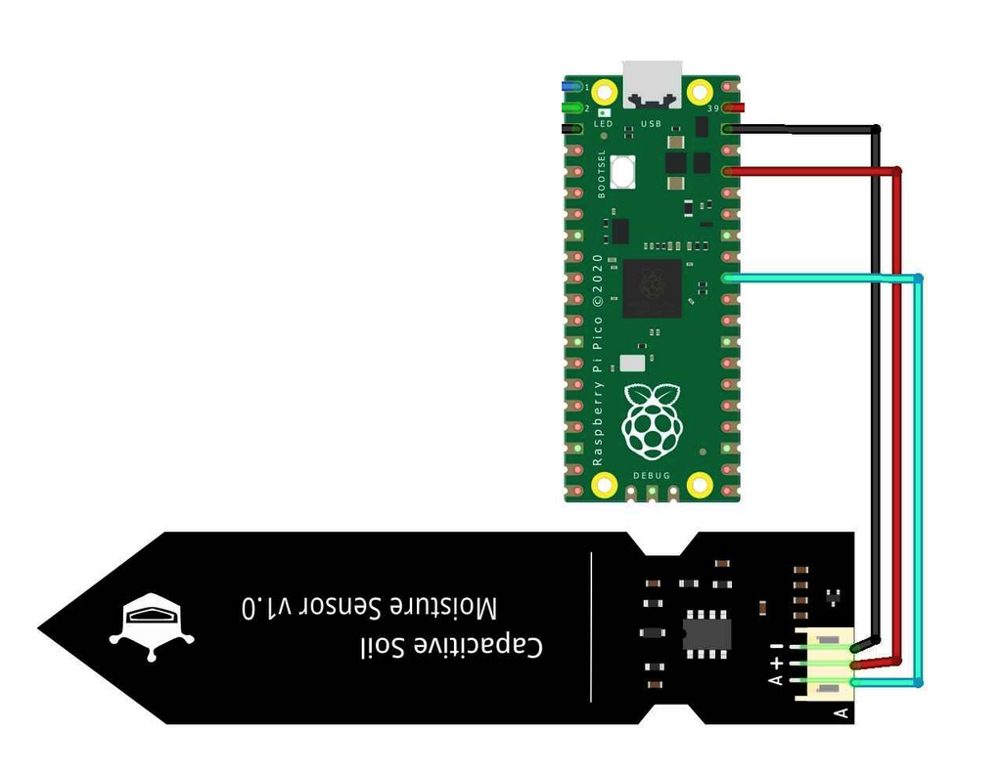
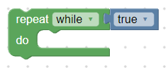

# Feuchtigkeitsmessung

## Einführung

Pflanzen benötigen Wasser zum Wachsen, und es ist wichtig zu wissen, ob die Erde, in der sie wachsen, feucht genug ist. Ein Feuchtigkeitssensor kann uns dabei helfen, die Feuchtigkeit der Erde zu messen und somit zu entscheiden, ob die Pflanze Wasser benötigt oder nicht. In diesem Projekt werden wir mit BIPES lernen, wie man einen Feuchtigkeitssensor anschließt und ausliest.

## Material

- Raspberry PI pico
- Feuchtigkeitssensor
- Breadboard und Verbindungskabel

## Features & Spezifikationen

1. **3-Pin Sensor**: Einfache Verbindung.
2. **Analoger Ausgang**: Zur Feuchtigkeitsmessung.
3. **Betriebsspannung**: DC 3.3-5.5V.
4. **Ausgangsspannung**: DC 0-3.0V.
5. **Schnittstelle**: PH2.0-3P.
6. **Größe**: 99x16mm.

## Schritt-für-Schritt Anleitung

### 1. Fritzing

Verkabel den Feuchtigkeitssensor und den Raspberry PI Pico wie im Bild unten gezeigt. Achte darauf, dass die Pins korrekt angeschlossen sind.

### 2. Block-Code Programmierung mit BIPES

Wiederum werden dir Bilder von den benötigten Blöcken gezeigt. Es ist deine Aufgabe, herauszufinden, wie sie zusammenpassen und den Feuchtigkeitswert auszulesen.

Verwende hierzu folgende Blöcke:

1. Unter `Loops`, einmal:

    

2. Unter `Variables` erstelle eine neue Variable namens `feuchtigkeitswert`.

3. Unter `Sensors`, einmal:

    

4. Unter `Text`, einmal print:

    

5. Unter `Timing`, einmal:

    

Experimentiere mit den Blöcken, um den Feuchtigkeitswert korrekt auszulesen und zu interpretieren. Übertrage das Programm dann auf den Raspberry PI pico.

### 3. Teste deinen Feuchtigkeitssensor

Stecke den Sensor sowohl in ein Glas Wasser als auch in die Luft, um die unterschiedlichen Werte zu beobachten und zu verstehen.

### 4. Konstanten setzen

Erstelle eine weitere Variable: `ZU_TROCKEN`. Wähle einen Wert zwischen dem Maximum, welches du in Wasser gemessen hast, und Minimum, welches du in der Luft gemessen hast. Diesen Wert brauchen wir später damit Pflanziska spricht, sollte es zu trocken sein.

## Problemlösung

Wenn du keine oder falsche Werte erhältst:

- Überprüfe alle Verbindungen.
- Schau, dass die richtigen Pins vom Pico sowohl im BIPES gewählt wurden.
- Überprüfe, ob du die richtigen Blöcke in BIPES verwendet hast und ob sie in der richtigen Reihenfolge sind.

## Fazit

Super! Du hast jetzt verstanden, wie ein Feuchtigkeitssensor funktioniert und wie man ihn mit dem Raspberry PI pico nutzen kann. Dieses Wissen wird uns helfen, unserer Pflanziska beizubringen, wann sie durstig ist.

## Vertiefende Materie

### Wie funktioniert ein Feuchtigkeitssensor?

Ein Feuchtigkeitssensor misst den Widerstand oder die Leitfähigkeit des Bodens. Wenn der Boden trocken ist, ist der Widerstand hoch, da er schlecht Strom leitet. Wenn der Boden feucht ist, sinkt der Widerstand, da Wasser die elektrische Leitfähigkeit des Bodens erhöht. Der Sensor gibt also einen Wert zurück, der je nach Feuchtigkeitsgrad des Bodens variiert. Mit diesem Wert können wir dann entscheiden, ob die Pflanze Wasser benötigt oder nicht.
